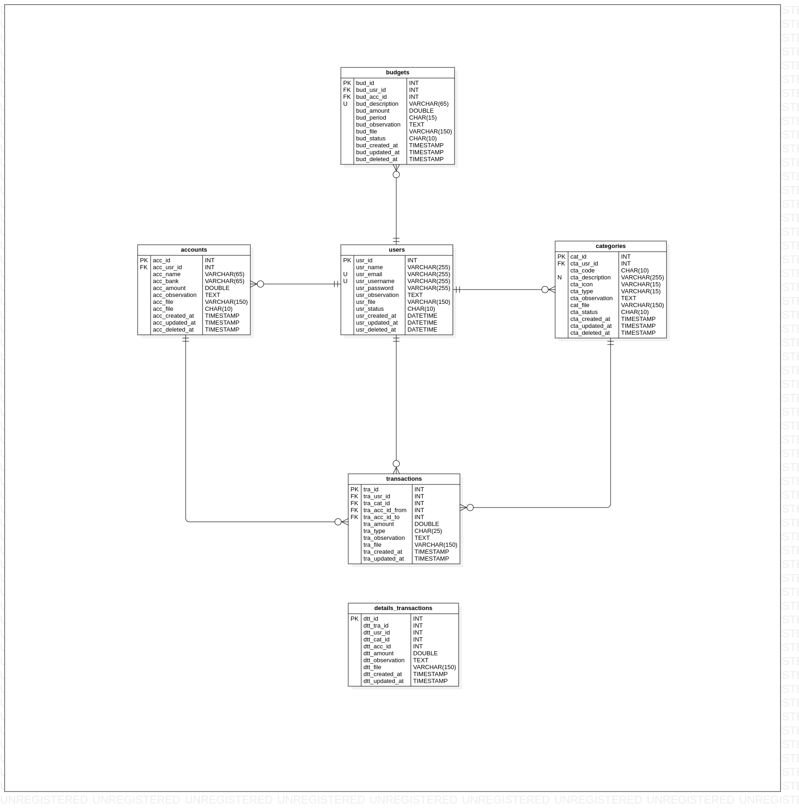

# Base de datos

## Modelo relacional



## Script SQL

```sql
DROP DATABASE IF EXISTS dbFinance;
CREATE DATABASE IF NOT EXISTS dbFinance;
USE dbFinance;

DROP TABLE IF EXISTS users;
CREATE TABLE IF NOT EXISTS users
(
    id          INT           NOT NULL AUTO_INCREMENT   COMMENT "Identificador único para la administración de los usuarios.",
    name        VARCHAR(255)      NULL DEFAULT null     COMMENT "Nombre propio del usuario.",
    email       VARCHAR(255)      NULL DEFAULT NULL     COMMENT "Correo electrónico del usuario.",
    password    VARCHAR(255)      NULL DEFAULT NULL     COMMENT "Contraseña de acceso del usuario.",
    observation TEXT              NULL DEFAULT NULL     COMMENT "Opcional, observaciones del usuario.",
    file        VARCHAR(150)      NULL DEFAULT NULL     COMMENT "Opcional, carga de archivo.",
    status      CHAR(20)          NULL DEFAULT "Activo" COMMENT "Estatus actual de usuario: [Activo | Inactivo].",
    created_at  TIMESTAMP         NULL DEFAULT NOW()    COMMENT "Datos de auditoria, Fecha de alta del registro.",
    updated_at  TIMESTAMP         NULL DEFAULT NOW()    COMMENT "Datos de auditoria, Fecha de actualización del registro.",
    deleted_at  TIMESTAMP         NULL DEFAULT NULL     COMMENT "Datos de auditoria, Fecha de baja del registro.",
    CONSTRAINT  pkUser            PRIMARY KEY(id),
    CONSTRAINT  ukUser            UNIQUE(email)
) COMMENT "Catalogo de usuarios con privilegios para el acceso al sistema.";

DROP TABLE IF EXISTS banks;
CREATE TABLE IF NOT EXISTS banks
(
    id           INT          NOT NULL  AUTO_INCREMENT   COMMENT "Identificador único para el catalogo de bancos.",
    usr_id       INT              NULL  DEFAULT NULL     COMMENT "Identificador del usuario.",
    abbreviature CHAR(25)         NULL  DEFAULT NULL     COMMENT "Abreviatura del banco.",
    name         VARCHAR(65)      NULL  DEFAULT NULL     COMMENT "Nombre del banco.",
    observation  TEXT             NULL  DEFAULT NULL     COMMENT "Opcional, observaciones generales del banco.",
    file         VARCHAR(150)     NULL  DEFAULT NULL     COMMENT "Opcional, nombre del archivo.",
    status       CHAR(20)         NULL  DEFAULT "Activo" COMMENT "Estatus actual del banco [Activo | Inactivo]",
    created_at   TIMESTAMP        NULL  DEFAULT now()    COMMENT "Datos de auditoria, fecha de alta del registro",
    updated_at   TIMESTAMP        NULL  DEFAULT now()    COMMENT "Datos de auditoria, fecha de actualización del registro",
    deleted_at   TIMESTAMP        NULL  DEFAULT now()    COMMENT "Datos de auditoria, fecha de baja del registro",
    CONSTRAINT   pkBank           PRIMARY KEY(id),
    CONSTRAINT   ukBank           UNIQUE(name),
    CONSTRAINT   fkBankUser       FOREIGN KEY(usr_id) REFERENCES users(id)
        ON DELETE SET NULL
        ON UPDATE SET NULL
) COMMENT "Catalogo de bancos.";

DROP TABLE IF EXISTS categories;
CREATE TABLE IF NOT EXISTS categories
(
    id           INT            NOT NULL AUTO_INCREMENT   COMMENT "Identificador único para el catalogo de categorías.",
    usr_id       INT                NULL DEFAULT NULL     COMMENT "Identificador del usuario.",
    code         CHAR(10)           NULL DEFAULT NULL     COMMENT "Opcional, código de la categoría.",
    name         VARCHAR(255)       NULL DEFAULT NULL     COMMENT "Descripción de la categoría.",
    icon         VARCHAR(15)        NULL DEFAULT NULL     COMMENT "Opcional, icono de categoría.",
    type         VARCHAR(15)        NULL DEFAULT NULL     COMMENT "Tipo de categoría: [ingreso | egreso].",
    observation  TEXT               NULL DEFAULT NULL     COMMENT "Opcional, observaciones de la categoría.",
    file         VARCHAR(150)       NULL DEFAULT NULL     COMMENT "Opcional, nombre del archivo.",
    status       CHAR(20)           NULL DEFAULT "Activo" COMMENT "Estatus actual de categoría: [Activo | Inactivo].",
    created_at   TIMESTAMP          NULL DEFAULT NOW()    COMMENT "Datos de auditoria, fecha de alta del registro.",
    updated_at   TIMESTAMP          NULL DEFAULT NOW()    COMMENT "Datos de auditoria, fecha de actualización del registro.",
    deleted_at   TIMESTAMP          NULL DEFAULT NULL     COMMENT "Datos de auditoria, fecha de baja del registro.",
    CONSTRAINT   pkCategory         PRIMARY KEY(id),
    CONSTRAINT   ukCategory         UNIQUE(name),
    CONSTRAINT   fkCategoryUser     FOREIGN KEY(usr_id) REFERENCES users(id)
        ON DELETE SET NULL
        ON UPDATE SET NULL
) COMMENT "Lista de categorías para clasificar los tipos";

DROP TABLE IF EXISTS debts;
CREATE TABLE IF NOT EXISTS debts
(
    id            INT         NOT NULL AUTO_INCREMENT  COMMENT "Identificador único para la administración de mis deudas.",
    usr_id        INT             NULL DEFAULT 1       COMMENT "Identificador del usuario.",
    cat_id        INT             NULL DEFAULT 1       COMMENT "Identificador de categoria.",
    name          VARCHAR(65)     NULL DEFAULT NULL    COMMENT "Nombre de la deuda.",
    amount        DOUBLE          NULL DEFAULT 0       COMMENT "Importe total de la deuda.",
    period        CHAR(15)        NULL DEFAULT NULL    COMMENT "Tipo de presupuesto: [diario|quincenal|mensual|anual].",
    day           INT             NULL DEFAULT NULL    COMMENT "Dia de pago de deuda para tipo de perido Mensual",
    date_at       DATETIME        NULL DEFAULT NULL    COMMENT "Fecha de pago de deuda para tipo de perido Anual",
    observation   TEXT            NULL DEFAULT NULL    COMMENT "Opcional, observaciones de la deuda.",
    file          VARCHAR(150)    NULL DEFAULT NULL    COMMENT "Opcional, nombre del archivo.",
    status        CHAR(20)        NULL DEFAULT NULL    COMMENT "Estatus actual de la deuda: [En curso | Completada | Cancelado ].",
    created_at    TIMESTAMP       NULL DEFAULT NOW()   COMMENT "Datos de auditoria, fecha de alta del registro.",
    updated_at    TIMESTAMP       NULL DEFAULT NOW()   COMMENT "Datos de auditoria, fecha de actualización del registro.",
    deleted_at    TIMESTAMP       NULL DEFAULT NULL    COMMENT "Datos de auditoria, fecha de baja del registro.",
    CONSTRAINT    pkDebt          PRIMARY KEY(id),
    CONSTRAINT    ukDebt          UNIQUE(name),
    CONSTRAINT    fkDebtUser      FOREIGN KEY(usr_id) REFERENCES users(id)
        ON DELETE SET NULL
        ON UPDATE SET NULL
) COMMENT "Administración de deudas.";

DROP TABLE IF EXISTS savings;
CREATE TABLE IF NOT EXISTS savings
(
    id            INT         NOT NULL AUTO_INCREMENT  COMMENT "Identificador único para las cuentas de ahorro.",
    usr_id        INT             NULL DEFAULT 1       COMMENT "Identificador del usuario.",
    name          VARCHAR(65)     NULL DEFAULT NULL    COMMENT "Nombre de la cuenta de ahorro.",
    amount        DOUBLE          NULL DEFAULT 0       COMMENT "Importe total para el ahorro.",
    observation   TEXT            NULL DEFAULT NULL    COMMENT "Opcional, observaciones del ahorro.",
    file          VARCHAR(150)    NULL DEFAULT NULL    COMMENT "Opcional, nombre del archivo.",
    status        CHAR(20)        NULL DEFAULT NULL    COMMENT "Estatus actual del ahorro: [Activo | Inactivo].",
    created_at    TIMESTAMP       NULL DEFAULT NOW()   COMMENT "Datos de auditoria, fecha de alta del registro.",
    updated_at    TIMESTAMP       NULL DEFAULT NOW()   COMMENT "Datos de auditoria, fecha de actualización del registro.",
    deleted_at    TIMESTAMP       NULL DEFAULT NULL    COMMENT "Datos de auditoria, fecha de bajo del registro.",
    CONSTRAINT    pkSaving        PRIMARY KEY(id),
    CONSTRAINT    ukSaving        UNIQUE(name),
    CONSTRAINT    fkSavingUser    FOREIGN KEY(usr_id) REFERENCES users(id)
        ON DELETE SET NULL
        ON UPDATE SET NULL
) COMMENT "Administración de ahorros.";

DROP TABLE IF EXISTS accounts;
CREATE TABLE IF NOT EXISTS accounts
(
    id           INT           NOT NULL AUTO_INCREMENT COMMENT "Identificador único para catálogos de cuentas bancarias.",
    usr_id       INT               NULL DEFAULT 1      COMMENT "Identificador del usuario.",
    ban_id       INT               NULL DEFAULT 1      COMMENT "Identificador del catalogo de bancos.",
    name         VARCHAR(65)       NULL DEFAULT NULL   COMMENT "Nombre corto de cuenta.",
    observation  TEXT              NULL DEFAULT NULL   COMMENT "Opcional, observaciones de la cuenta.",
    file         VARCHAR(150)      NULL DEFAULT NULL   COMMENT "Opcional, nombre de archivo.",
    status       CHAR(20)          NULL DEFAULT NULL   COMMENT "Estatus actual de cuenta: [Activo | Inactivo].",
    created_at   TIMESTAMP         NULL DEFAULT NOW()  COMMENT "Datos de auditoria, fecha de alta del registro.",
    updated_at   TIMESTAMP         NULL DEFAULT NOW()  COMMENT "Datos de auditoria, fecha de actualización del registro.",
    deleted_at   TIMESTAMP         NULL DEFAULT NULL   COMMENT "Datos de auditoria, fecha de baja del registro.",
    CONSTRAINT   pkAccount         PRIMARY KEY(id),
    CONSTRAINT   fkAccountUser     FOREIGN KEY(usr_id) REFERENCES users(id)
        ON DELETE SET NULL
        ON UPDATE SET NULL,
    CONSTRAINT   fkAccountBank     FOREIGN KEY(ban_id) REFERENCES banks(id)
        ON DELETE SET NULL
        ON UPDATE SET NULL
) COMMENT "Catalogo de cuentas bancarias.";

DROP TABLE IF EXISTS budgets;
CREATE TABLE IF NOT EXISTS budgets
(
    id           INT           NOT NULL AUTO_INCREMENT COMMENT "Identificador único del presupuesto.",
    usr_id       INT               NULL DEFAULT 1      COMMENT "Identificador del usuario.",
    acc_id       INT               NULL DEFAULT NULL   COMMENT "Opcional, presupuesto basado por cuentas.",
    name         VARCHAR(65)       NULL DEFAULT NULL   COMMENT "Descripción del presupuesto.",
    amount       DOUBLE            NULL DEFAULT NULL   COMMENT "Importe total del presupuesto.",
    period       CHAR(15)          NULL DEFAULT NULL   COMMENT "Tipo de presupuesto: [diario|quincenal|mensual|anual].",
    observation  TEXT              NULL DEFAULT NULL   COMMENT "Opcional, observaciones del presupuesto.",
    file         VARCHAR(150)      NULL DEFAULT NULL   COMMENT "Opcional, nombre de archivo.",
    status       CHAR(20)          NULL DEFAULT NULL   COMMENT "Estatus actual de presupuesto: [Activo | Inactivo].",
    created_at   TIMESTAMP         NULL DEFAULT NOW()  COMMENT "Datos de auditoria, fecha de alta del registro.",
    updated_at   TIMESTAMP         NULL DEFAULT NOW()  COMMENT "Datos de auditoria, fecha de actualización del registro.",
    deleted_at   TIMESTAMP         NULL DEFAULT NULL   COMMENT "Datos de auditoria, fecha de baja del registro.",
    CONSTRAINT   pkBudget          PRIMARY KEY(id),
    CONSTRAINT   ukBudget          UNIQUE(name),
    CONSTRAINT   fkBudgetUser      FOREIGN KEY(usr_id) REFERENCES users(id)
        ON DELETE SET NULL
        ON UPDATE SET NULL,
    CONSTRAINT   fkBudgetAccount   FOREIGN KEY(acc_id) REFERENCES accounts(id)
        ON DELETE SET NULL
        ON UPDATE SET NULL
) COMMENT "Administración de presupuestos.";

DROP TABLE IF EXISTS ingresses;
CREATE TABLE IF NOT EXISTS ingresses
(
    id           INT           NOT NULL AUTO_INCREMENT COMMENT "Identificador único de la operación de ingreso.",
    usr_id       INT               NULL DEFAULT 1      COMMENT "Identificador del usuario.",
    cat_id       INT               NULL DEFAULT 1      COMMENT "Identificador de la categoría.",
    sav_id       INT               NULL DEFAULT 1      COMMENT "Identificador de la cuenta de ahorro.",
    deb_id       INT               NULL DEFAULT 1      COMMENT "Identificador de la deuda.",
    acc_id       INT               NULL DEFAULT 1      COMMENT "Identificador de la cuenta.",
    concept      VARCHAR(255)      NULL DEFAULT NULL   COMMENT "Opcional, nombre del concepto.",
    reference    VARCHAR(255)      NULL DEFAULT NULL   COMMENT "Opcional, referencia del ingreso.",
    amount       DOUBLE            NULL DEFAULT 0      COMMENT "Importe total del ingreso.",
    observation  TEXT              NULL DEFAULT NULL   COMMENT "Opcional, observaciones de la operación.",
    file         VARCHAR(150)      NULL DEFAULT NULL   COMMENT "Opcional, nombre de archivo.",
    created_at   TIMESTAMP         NULL DEFAULT NOW()  COMMENT "Datos de auditoria, fecha de alta del registro.",
    updated_at   TIMESTAMP         NULL DEFAULT NOW()  COMMENT "Datos de auditoria, fecha de actualización del registro.",
    CONSTRAINT   pkIngress         PRIMARY KEY(id),
    CONSTRAINT   fkIngressUser     FOREIGN KEY(usr_id) REFERENCES users(id)
        ON DELETE SET NULL
        ON UPDATE SET NULL,
    CONSTRAINT   fkIngressCategory FOREIGN KEY(cat_id) REFERENCES categories(id)
        ON DELETE SET NULL
        ON UPDATE SET NULL,
    CONSTRAINT   fkIngressSaving   FOREIGN KEY(sav_id) REFERENCES savings(id)
        ON DELETE SET NULL
        ON UPDATE SET NULL,
    CONSTRAINT   fkIngressDebt     FOREIGN KEY(deb_id) REFERENCES debts(id)
        ON DELETE SET NULL
        ON UPDATE SET NULL,
    CONSTRAINT   fkIngressAccount  FOREIGN KEY(acc_id) REFERENCES accounts(id)
        ON DELETE SET NULL
        ON UPDATE SET NULL
) COMMENT "Operaciones de ingresos";

DROP TABLE IF EXISTS egresses;
CREATE TABLE IF NOT EXISTS egresses
(
    id           INT           NOT NULL AUTO_INCREMENT COMMENT "Identificador único de la operación de egreso.",
    usr_id       INT               NULL DEFAULT 1      COMMENT "Identificador del usuario.",
    cat_id       INT               NULL DEFAULT 1      COMMENT "Identificador de la categoría.",
    sav_id       INT               NULL DEFAULT 1      COMMENT "Identificador de la cuenta de ahorro.",
    deb_id       INT               NULL DEFAULT 1      COMMENT "Identificador de la deuda.",
    acc_id       INT               NULL DEFAULT 1      COMMENT "Identificador de la cuenta.",
    concept      VARCHAR(255)      NULL DEFAULT NULL   COMMENT "Opcional, nombre del concepto.",
    reference    VARCHAR(255)      NULL DEFAULT NULL   COMMENT "Opcional, referencia del egreso.",
    amount       DOUBLE            NULL DEFAULT 0      COMMENT "Importe total del egreso.",
    observation  TEXT              NULL DEFAULT NULL   COMMENT "Opcional, observaciones de la operación.",
    file         VARCHAR(150)      NULL DEFAULT NULL   COMMENT "Opcional, nombre de archivo.",
    created_at   TIMESTAMP         NULL DEFAULT NOW()  COMMENT "Datos de auditoria, fecha de alta del registro.",
    updated_at   TIMESTAMP         NULL DEFAULT NOW()  COMMENT "Datos de auditoria, fecha de actualización del registro.",
    CONSTRAINT   pkEgress          PRIMARY KEY(id),
    CONSTRAINT   fkEgressUser      FOREIGN KEY(usr_id) REFERENCES users(id)
        ON DELETE SET NULL
        ON UPDATE SET NULL,
    CONSTRAINT   fkEgressCategory  FOREIGN KEY(cat_id) REFERENCES categories(id)
        ON DELETE SET NULL
        ON UPDATE SET NULL,
    CONSTRAINT   fkEgressSaving    FOREIGN KEY(sav_id) REFERENCES savings(id)
        ON DELETE SET NULL
        ON UPDATE SET NULL,
    CONSTRAINT   fkEgressDebt      FOREIGN KEY(deb_id) REFERENCES debts(id)
        ON DELETE SET NULL
        ON UPDATE SET NULL,
    CONSTRAINT   fkEgressAccount   FOREIGN KEY(acc_id) REFERENCES accounts(id)
        ON DELETE SET NULL
        ON UPDATE SET NULL
) COMMENT "Operaciones de ingresos";

DROP TABLE IF EXISTS transactions;
CREATE TABLE IF NOT EXISTS transactions
(
    id           INT           NOT NULL AUTO_INCREMENT COMMENT "Identificador único de la transacción.",
    usr_id       INT               NULL DEFAULT 1      COMMENT "Identificador del usuario.",
    cat_id       INT               NULL DEFAULT 1      COMMENT "Identificador de la categoría.",
    acc_id_from  INT               NULL DEFAULT 1      COMMENT "Identificador de la cuenta origen.",
    acc_id_to    INT               NULL DEFAULT 1      COMMENT "Identificador de la cuenta destino.",
    sav_id       INT               NULL DEFAULT 1      COMMENT "Identificador de cuentas de ahorro.",
    deb_id       INT               NULL DEFAULT 1      COMMENT "Identificador de cuantas de deuda.",
    amount       DOUBLE            NULL DEFAULT NULL   COMMENT "Importe total de la operación.",
    type         CHAR(25)          NULL DEFAULT NULL   COMMENT "Tipo de transacción: [ingreso | egreso].",
    observation  TEXT              NULL DEFAULT NULL   COMMENT "Opcional, observaciones de la transacción.",
    file         VARCHAR(150)      NULL DEFAULT NULL   COMMENT "Opcional, nombre de archivo.",
    created_at   TIMESTAMP         NULL DEFAULT NOW()  COMMENT "Datos de auditoria, fecha de alta del registro.",
    updated_at   TIMESTAMP         NULL DEFAULT NOW()  COMMENT "Datos de auditoria, fecha de actualización del registro.",
    CONSTRAINT   pkTransaction     PRIMARY KEY(id)
) COMMENT "Historial de operaciones de ingresos y egresos";

```
