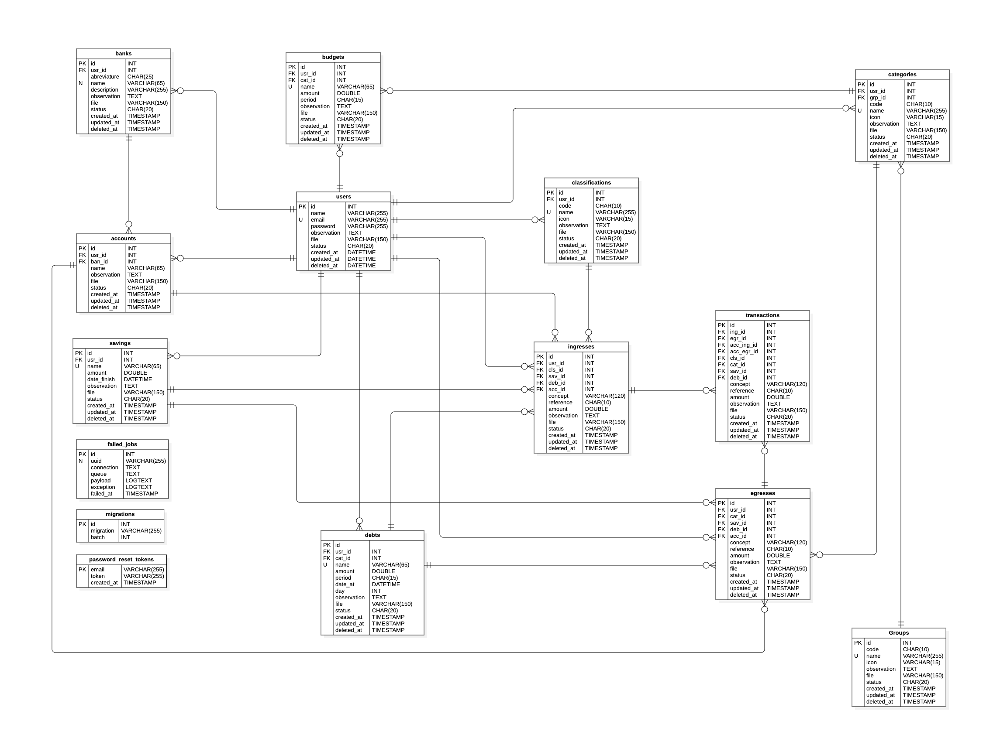

# Base de datos

## Modelo relacional



## Script SQL

```sql

DROP DATABASE IF EXISTS dbFinzaApp;
CREATE DATABASE IF NOT EXISTS dbFinzaApp;
USE dbFinzaApp;

DROP TABLE IF EXISTS failed_jobs;
CREATE TABLE failed_jobs (
    id          BIGINT           UNSIGNED                   NOT NULL AUTO_INCREMENT,
    uuid        VARCHAR(255)     COLLATE utf8mb4_unicode_ci NOT NULL,
    connection  TEXT             COLLATE utf8mb4_unicode_ci NOT NULL,
    queue       TEXT             COLLATE utf8mb4_unicode_ci NOT NULL,
    payload     TEXT             COLLATE utf8mb4_unicode_ci NOT NULL,
    exception   TEXT             COLLATE utf8mb4_unicode_ci NOT NULL,
    failed_at   TIMESTAMP                                   NOT NULL DEFAULT CURRENT_TIMESTAMP,
    CONSTRAINT  pkFailedJob PRIMARY KEY (id),
    CONSTRAINT  ukFailedJob UNIQUE KEY  (uuid)
) ENGINE=InnoDB DEFAULT CHARSET=utf8mb4 COLLATE=utf8mb4_unicode_ci;

DROP TABLE IF EXISTS migrations;
CREATE TABLE migrations (
    id         INT          UNSIGNED                   NOT NULL AUTO_INCREMENT,
    migration  VARCHAR(255) COLLATE utf8mb4_unicode_ci NOT NULL,
    batch      INT                                     NOT NULL,
    CONSTRAINT pkMigration PRIMARY KEY (id)
) ENGINE=InnoDB AUTO_INCREMENT=23 DEFAULT CHARSET=utf8mb4 COLLATE=utf8mb4_unicode_ci;

DROP TABLE IF EXISTS password_reset_tokens;
CREATE TABLE password_reset_tokens (
    email      VARCHAR(255) COLLATE utf8mb4_unicode_ci NOT NULL,
    token      VARCHAR(255) COLLATE utf8mb4_unicode_ci NOT NULL,
    created_at TIMESTAMP                                   NULL DEFAULT NULL,
    CONSTRAINT pkPasswordResetToken PRIMARY KEY (email)
) ENGINE=InnoDB DEFAULT CHARSET=utf8mb4 COLLATE=utf8mb4_unicode_ci;

DROP TABLE IF EXISTS personal_access_tokens;
CREATE TABLE personal_access_tokens (
    id             BIGINT       UNSIGNED                   NOT NULL AUTO_INCREMENT,
    tokenable_type VARCHAR(255) COLLATE utf8mb4_unicode_ci NOT NULL,
    tokenable_id   BIGINT       UNSIGNED                   NOT NULL,
    name           VARCHAR(255) COLLATE utf8mb4_unicode_ci NOT NULL,
    token          VARCHAR(64)  COLLATE utf8mb4_unicode_ci NOT NULL,
    abilities      TEXT         COLLATE utf8mb4_unicode_ci,
    last_used_at   TIMESTAMP                                    NULL DEFAULT NULL,
    expires_at     TIMESTAMP                                    NULL DEFAULT NULL,
    created_at     TIMESTAMP                                    NULL DEFAULT NULL,
    updated_at     TIMESTAMP                                    NULL DEFAULT NULL,
    CONSTRAINT     pkPersonalAccessToken PRIMARY KEY (id),
    CONSTRAINT     pkPersonalAccessToken UNIQUE KEY  (token),
    KEY personal_access_tokens_tokenable_type_tokenable_id_index (tokenable_type,tokenable_id)
) ENGINE=InnoDB DEFAULT CHARSET=utf8mb4 COLLATE=utf8mb4_unicode_ci;

DROP TABLE IF EXISTS users;
CREATE TABLE users (
    id                BIGINT       UNSIGNED                   NOT NULL AUTO_INCREMENT,
    name              VARCHAR(255) COLLATE utf8mb4_unicode_ci NOT NULL,
    email             VARCHAR(255) COLLATE utf8mb4_unicode_ci NOT NULL,
    password          VARCHAR(255) COLLATE utf8mb4_unicode_ci NOT NULL,
    file              VARCHAR(150) COLLATE utf8mb4_unicode_ci          DEFAULT NULL,
    observation       TEXT         COLLATE utf8mb4_unicode_ci,
    status            VARCHAR(20)  COLLATE utf8mb4_unicode_ci NOT NULL DEFAULT 'Activo',
    email_verified_at TIMESTAMP                                   NULL DEFAULT NULL,
    remember_token    VARCHAR(100) COLLATE utf8mb4_unicode_ci          DEFAULT NULL,
    created_at        TIMESTAMP                                   NULL DEFAULT NULL,
    updated_at        TIMESTAMP                                   NULL DEFAULT NULL,
    deleted_at        TIMESTAMP                                   NULL DEFAULT NULL,
    CONSTRAINT        pkUser PRIMARY KEY (id),
    CONSTRAINT        pkUser UNIQUE KEY  (email)
) ENGINE=InnoDB DEFAULT CHARSET=utf8mb4 COLLATE=utf8mb4_unicode_ci;

DROP TABLE IF EXISTS banks;
CREATE TABLE banks (
    id           BIGINT      UNSIGNED                   NOT NULL AUTO_INCREMENT,
    usr_id       BIGINT      UNSIGNED                            DEFAULT NULL,
    abbreviature VARCHAR(25) COLLATE utf8mb4_unicode_ci          DEFAULT NULL,
    name         VARCHAR(65) COLLATE utf8mb4_unicode_ci NOT NULL,
    file         VARCHAR(10) COLLATE utf8mb4_unicode_ci          DEFAULT NULL,
    observation  TEXT        COLLATE utf8mb4_unicode_ci,
    status       VARCHAR(20) COLLATE utf8mb4_unicode_ci          DEFAULT 'Activo',
    created_at   TIMESTAMP                                  NULL DEFAULT NULL,
    updated_at   TIMESTAMP                                  NULL DEFAULT NULL,
    deleted_at   TIMESTAMP                                  NULL DEFAULT NULL,
    CONSTRAINT   pkBank      PRIMARY KEY (id),
    CONSTRAINT   pkBank      UNIQUE KEY  (name),
    CONSTRAINT   fkUserBank  FOREIGN KEY (usr_id) REFERENCES users (id) ON DELETE SET NULL
) ENGINE=InnoDB DEFAULT CHARSET=utf8mb4 COLLATE=utf8mb4_unicode_ci;

DROP TABLE IF EXISTS classifications;
CREATE TABLE classifications (
    id          BIGINT       UNSIGNED                   NOT NULL AUTO_INCREMENT,
    usr_id      BIGINT       UNSIGNED                            DEFAULT NULL,
    code        VARCHAR(10)  COLLATE utf8mb4_unicode_ci          DEFAULT NULL,
    name        VARCHAR(255) COLLATE utf8mb4_unicode_ci NOT NULL,
    icon        VARCHAR(15)  COLLATE utf8mb4_unicode_ci     NULL DEFAULT NULL,
    file        VARCHAR(10)  COLLATE utf8mb4_unicode_ci          DEFAULT NULL,
    observation TEXT         COLLATE utf8mb4_unicode_ci,
    status      VARCHAR(20)  COLLATE utf8mb4_unicode_ci          DEFAULT 'Activo',
    created_at  TIMESTAMP                                   NULL DEFAULT NULL,
    updated_at  TIMESTAMP                                   NULL DEFAULT NULL,
    deleted_at  TIMESTAMP                                   NULL DEFAULT NULL,
    CONSTRAINT  pkClassification     PRIMARY KEY (id),
    CONSTRAINT  pkClassification     UNIQUE KEY  (name),
    CONSTRAINT  ukUserClassification FOREIGN KEY (usr_id) REFERENCES users (id) ON DELETE SET NULL
) ENGINE=InnoDB DEFAULT CHARSET=utf8mb4 COLLATE=utf8mb4_unicode_ci;

DROP TABLE IF EXISTS genders;
CREATE TABLE genders
(
    id          BIGINT       UNSIGNED                   NOT NULL AUTO_INCREMENT,
    usr_id      BIGINT       UNSIGNED                            DEFAULT NULL,
    code        CHAR(10)     COLLATE utf8mb4_unicode_ci          DEFAULT NULL,
    name        VARCHAR(255) COLLATE utf8mb4_unicode_ci          DEFAULT NULL,
    icon        VARCHAR(15)  COLLATE utf8mb4_unicode_ci          DEFAULT NULL,
    file        VARCHAR(150) COLLATE utf8mb4_unicode_ci          DEFAULT NULL,
    observation TEXT         COLLATE utf8mb4_unicode_ci,
    status      VARCHAR(20)  COLLATE utf8mb4_unicode_ci          DEFAULT 'Activo',
    created_at  TIMESTAMP                                   NULL DEFAULT NULL,
    updated_at  TIMESTAMP                                   NULL DEFAULT NULL,
    deleted_at  TIMESTAMP                                   NULL DEFAULT NULL,
    CONSTRAINT  pkGroup     PRIMARY KEY (id),
    CONSTRAINT  pkGroup     UNIQUE KEY  (name),
    CONSTRAINT  pkUserGroup FOREIGN KEY (usr_id) REFERENCES users (id) ON DELETE SET NULL
) ENGINE=InnoDB DEFAULT CHARSET=utf8mb4 COLLATE=utf8mb4_unicode_ci;

DROP TABLE IF EXISTS categories;
CREATE TABLE categories (
    id          BIGINT       UNSIGNED                   NOT NULL AUTO_INCREMENT,
    usr_id      BIGINT       UNSIGNED                            DEFAULT NULL,
    gen_id      BIGINT       UNSIGNED                            DEFAULT NULL,
    code        VARCHAR(10)  COLLATE utf8mb4_unicode_ci          DEFAULT NULL,
    name        VARCHAR(255) COLLATE utf8mb4_unicode_ci NOT NULL,
    icon        VARCHAR(15)  COLLATE utf8mb4_unicode_ci          DEFAULT NULL,
    file        VARCHAR(150) COLLATE utf8mb4_unicode_ci          DEFAULT NULL,
    observation TEXT         COLLATE utf8mb4_unicode_ci,
    status      VARCHAR(20)  COLLATE utf8mb4_unicode_ci          DEFAULT 'Activo',
    created_at  TIMESTAMP                                   NULL DEFAULT NULL,
    updated_at  TIMESTAMP                                   NULL DEFAULT NULL,
    deleted_at  TIMESTAMP                                   NULL DEFAULT NULL,
    CONSTRAINT  pkCategory       PRIMARY KEY (id),
    CONSTRAINT  pkCategory       UNIQUE KEY  (name),
    CONSTRAINT  pkUserCategory   FOREIGN KEY (usr_id) REFERENCES users   (id) ON DELETE SET NULL,
    CONSTRAINT  pkGenderCategory FOREIGN KEY (gen_id) REFERENCES genders (id) ON DELETE SET NULL
) ENGINE=InnoDB DEFAULT CHARSET=utf8mb4 COLLATE=utf8mb4_unicode_ci;

DROP TABLE IF EXISTS debts;
CREATE TABLE debts (
    id          BIGINT       UNSIGNED                   NOT NULL AUTO_INCREMENT,
    usr_id      BIGINT       UNSIGNED                            DEFAULT NULL,
    cat_id      BIGINT       UNSIGNED                            DEFAULT NULL,
    name        VARCHAR(65)  COLLATE utf8mb4_unicode_ci NOT NULL,
    amount      DOUBLE                                           DEFAULT '0',
    period      VARCHAR(15)  COLLATE utf8mb4_unicode_ci          DEFAULT NULL,
    day         SMALLINT                                         DEFAULT NULL,
    date_at     TIMESTAMP                                   NULL DEFAULT NULL,
    file        VARCHAR(150) COLLATE utf8mb4_unicode_ci          DEFAULT NULL,
    observation TEXT         COLLATE utf8mb4_unicode_ci,
    status      VARCHAR(20)  COLLATE utf8mb4_unicode_ci          DEFAULT 'Activo',
    created_at  TIMESTAMP                                   NULL DEFAULT NULL,
    updated_at  TIMESTAMP                                   NULL DEFAULT NULL,
    deleted_at  TIMESTAMP                                   NULL DEFAULT NULL,
    CONSTRAINT  pkDebt         PRIMARY KEY (id),
    CONSTRAINT  ukDebt         UNIQUE KEY  (name),
    CONSTRAINT  fkCategoryDebt FOREIGN KEY (cat_id) REFERENCES categories (id) ON DELETE SET NULL,
    CONSTRAINT  fkUserDebt     FOREIGN KEY (usr_id) REFERENCES users (id)      ON DELETE SET NULL
) ENGINE=InnoDB DEFAULT CHARSET=utf8mb4 COLLATE=utf8mb4_unicode_ci;

DROP TABLE IF EXISTS savings;
CREATE TABLE savings (
    id          BIGINT       UNSIGNED                   NOT NULL AUTO_INCREMENT,
    usr_id      BIGINT       UNSIGNED                            DEFAULT NULL,
    name        VARCHAR(65)  COLLATE utf8mb4_unicode_ci NOT NULL,
    amount      DOUBLE                                           DEFAULT '0',
    date_finish TIMESTAMP                                   NULL DEFAULT NULL,
    file        VARCHAR(150) COLLATE utf8mb4_unicode_ci     NULL DEFAULT NULL,
    observation TEXT         COLLATE utf8mb4_unicode_ci,
    status      VARCHAR(20)  COLLATE utf8mb4_unicode_ci          DEFAULT 'Activo',
    created_at  TIMESTAMP                                   NULL DEFAULT NULL,
    updated_at  TIMESTAMP                                   NULL DEFAULT NULL,
    deleted_at  TIMESTAMP                                   NULL DEFAULT NULL,
    CONSTRAINT  pkSaving     PRIMARY KEY (id),
    CONSTRAINT  ukSaving     UNIQUE KEY  (name),
    CONSTRAINT  fkUserSaving FOREIGN KEY (usr_id) REFERENCES users (id) ON DELETE SET NULL
) ENGINE=InnoDB DEFAULT CHARSET=utf8mb4 COLLATE=utf8mb4_unicode_ci;

DROP TABLE IF EXISTS accounts;
CREATE TABLE accounts (
    id          BIGINT       UNSIGNED                   NOT NULL AUTO_INCREMENT,
    usr_id      BIGINT       UNSIGNED                            DEFAULT NULL,
    ban_id      BIGINT       UNSIGNED                            DEFAULT NULL,
    name        VARCHAR(65)  COLLATE utf8mb4_unicode_ci NOT NULL,
    file        VARCHAR(150) COLLATE utf8mb4_unicode_ci          DEFAULT NULL,
    observation TEXT         COLLATE utf8mb4_unicode_ci,
    status      VARCHAR(20)  COLLATE utf8mb4_unicode_ci          DEFAULT 'Activo',
    created_at  TIMESTAMP                                   NULL DEFAULT NULL,
    updated_at  TIMESTAMP                                   NULL DEFAULT NULL,
    deleted_at  TIMESTAMP                                   NULL DEFAULT NULL,
    CONSTRAINT  pkAccount     PRIMARY KEY (id),
    CONSTRAINT  fkBankAccount FOREIGN KEY (ban_id) REFERENCES banks (id) ON DELETE SET NULL,
    CONSTRAINT  fkUserAccount FOREIGN KEY (usr_id) REFERENCES users (id) ON DELETE SET NULL
) ENGINE=InnoDB DEFAULT CHARSET=utf8mb4 COLLATE=utf8mb4_unicode_ci;

DROP TABLE IF EXISTS budgets;
CREATE TABLE budgets (
    id          BIGINT       UNSIGNED                   NOT NULL AUTO_INCREMENT,
    usr_id      BIGINT       UNSIGNED                            DEFAULT NULL,
    acc_id      BIGINT       UNSIGNED                            DEFAULT NULL,
    name        VARCHAR(65)  COLLATE utf8mb4_unicode_ci NOT NULL,
    amount      DOUBLE                                           DEFAULT '0',
    period      VARCHAR(15)  COLLATE utf8mb4_unicode_ci          DEFAULT NULL,
    file        VARCHAR(150) COLLATE utf8mb4_unicode_ci          DEFAULT NULL,
    observation TEXT         COLLATE utf8mb4_unicode_ci,
    status      VARCHAR(20)  COLLATE utf8mb4_unicode_ci          DEFAULT 'Activo',
    created_at  TIMESTAMP                                   NULL DEFAULT NULL,
    updated_at  TIMESTAMP                                   NULL DEFAULT NULL,
    deleted_at  TIMESTAMP                                   NULL DEFAULT NULL,
    CONSTRAINT  pkBudget        PRIMARY KEY (id),
    CONSTRAINT  ukBudget        UNIQUE KEY  (name),
    CONSTRAINT  fkAccountBudget FOREIGN KEY (acc_id) REFERENCES accounts (id) ON DELETE SET NULL,
    CONSTRAINT  fkUserBudget    FOREIGN KEY (usr_id) REFERENCES users (id)    ON DELETE SET NULL
) ENGINE=InnoDB DEFAULT CHARSET=utf8mb4 COLLATE=utf8mb4_unicode_ci;

DROP TABLE IF EXISTS ingresses;
CREATE TABLE ingresses (
    id          BIGINT       UNSIGNED                   NOT NULL AUTO_INCREMENT,
    usr_id      BIGINT       UNSIGNED                            DEFAULT NULL,
    cls_id      BIGINT       UNSIGNED                            DEFAULT NULL,
    sav_id      BIGINT       UNSIGNED                            DEFAULT NULL,
    deb_id      BIGINT       UNSIGNED                            DEFAULT NULL,
    acc_id      BIGINT       UNSIGNED                            DEFAULT NULL,
    concept     VARCHAR(255) COLLATE utf8mb4_unicode_ci          DEFAULT NULL,
    description VARCHAR(255) COLLATE utf8mb4_unicode_ci          DEFAULT NULL,
    reference   VARCHAR(255) COLLATE utf8mb4_unicode_ci          DEFAULT NULL,
    amount      DOUBLE                                           DEFAULT '0',
    file        VARCHAR(150) COLLATE utf8mb4_unicode_ci          DEFAULT NULL,
    observation TEXT         COLLATE utf8mb4_unicode_ci,
    status      VARCHAR(20)  COLLATE utf8mb4_unicode_ci          DEFAULT 'Activo',
    created_at  TIMESTAMP                                   NULL DEFAULT NULL,
    updated_at  TIMESTAMP                                   NULL DEFAULT NULL,
    deleted_at  TIMESTAMP                                   NULL DEFAULT NULL,
    CONSTRAINT  pkIngress               PRIMARY KEY (id),
    CONSTRAINT  fkAccountIngress        FOREIGN KEY (acc_id) REFERENCES accounts (id)        ON DELETE SET NULL,
    CONSTRAINT  fkClassificationIngress FOREIGN KEY (cls_id) REFERENCES classifications (id) ON DELETE SET NULL,
    CONSTRAINT  fkDebtIngress           FOREIGN KEY (deb_id) REFERENCES debts (id)           ON DELETE SET NULL,
    CONSTRAINT  fkSavingIngress         FOREIGN KEY (sav_id) REFERENCES savings (id)         ON DELETE SET NULL,
    CONSTRAINT  fkUserIngress           FOREIGN KEY (usr_id) REFERENCES users (id)           ON DELETE SET NULL
) ENGINE=InnoDB DEFAULT CHARSET=utf8mb4 COLLATE=utf8mb4_unicode_ci;

DROP TABLE IF EXISTS egresses;
CREATE TABLE egresses (
    id          BIGINT       UNSIGNED                   NOT NULL AUTO_INCREMENT,
    usr_id      BIGINT       UNSIGNED                            DEFAULT NULL,
    cat_id      BIGINT       UNSIGNED                            DEFAULT NULL,
    sav_id      BIGINT       UNSIGNED                            DEFAULT NULL,
    deb_id      BIGINT       UNSIGNED                            DEFAULT NULL,
    acc_id      BIGINT       UNSIGNED                            DEFAULT NULL,
    concept     VARCHAR(255) COLLATE utf8mb4_unicode_ci          DEFAULT NULL,
    description VARCHAR(255) COLLATE utf8mb4_unicode_ci          DEFAULT NULL,
    reference   VARCHAR(255) COLLATE utf8mb4_unicode_ci          DEFAULT NULL,
    amount      DOUBLE                                           DEFAULT '0',
    file        VARCHAR(150) COLLATE utf8mb4_unicode_ci          DEFAULT NULL,
    observation TEXT         COLLATE utf8mb4_unicode_ci,
    status      VARCHAR(20)  COLLATE utf8mb4_unicode_ci          DEFAULT 'Activo',
    created_at  TIMESTAMP                                   NULL DEFAULT NULL,
    updated_at  TIMESTAMP                                   NULL DEFAULT NULL,
    deleted_at  TIMESTAMP                                   NULL DEFAULT NULL,
    CONSTRAINT  pkEgress         PRIMARY KEY (id),
    CONSTRAINT  fkAccountEgress  FOREIGN KEY (acc_id) REFERENCES accounts (id)   ON DELETE SET NULL,
    CONSTRAINT  fkCategoryEgress FOREIGN KEY (cat_id) REFERENCES categories (id) ON DELETE SET NULL,
    CONSTRAINT  fkDebtEgress     FOREIGN KEY (deb_id) REFERENCES debts (id)      ON DELETE SET NULL,
    CONSTRAINT  fkSavingEgress   FOREIGN KEY (sav_id) REFERENCES savings (id)    ON DELETE SET NULL,
    CONSTRAINT  fkUserEgress     FOREIGN KEY (usr_id) REFERENCES users (id)      ON DELETE SET NULL
) ENGINE=InnoDB DEFAULT CHARSET=utf8mb4 COLLATE=utf8mb4_unicode_ci;

DROP TABLE IF EXISTS transactions;
CREATE TABLE transactions (
    id          BIGINT       UNSIGNED                   NOT NULL AUTO_INCREMENT,
    usr_id      BIGINT       UNSIGNED                            DEFAULT NULL,
    ing_id      BIGINT       UNSIGNED                            DEFAULT NULL,
    egr_id      BIGINT       UNSIGNED                            DEFAULT NULL,
    acc_ing_id  BIGINT       UNSIGNED                            DEFAULT NULL,
    acc_egr_id  BIGINT       UNSIGNED                            DEFAULT NULL,
    concept     VARCHAR(255) COLLATE utf8mb4_unicode_ci          DEFAULT NULL,
    description VARCHAR(255) COLLATE utf8mb4_unicode_ci          DEFAULT NULL,
    reference   VARCHAR(255) COLLATE utf8mb4_unicode_ci          DEFAULT NULL,
    amount      DOUBLE                                           DEFAULT '0',
    file        VARCHAR(150) COLLATE utf8mb4_unicode_ci          DEFAULT NULL,
    observation TEXT         COLLATE utf8mb4_unicode_ci,
    status      VARCHAR(20)  COLLATE utf8mb4_unicode_ci          DEFAULT 'Activo',
    created_at  TIMESTAMP                                   NULL DEFAULT NULL,
    updated_at  TIMESTAMP                                   NULL DEFAULT NULL,
    deleted_at  TIMESTAMP                                   NULL DEFAULT NULL,
    CONSTRAINT  pkTransaction               PRIMARY KEY (id),
    CONSTRAINT  fkIngressTransaction        FOREIGN KEY (ing_id)     REFERENCES ingresses (id) ON DELETE SET NULL,
    CONSTRAINT  fkEgressTransaction         FOREIGN KEY (egr_id)     REFERENCES egresses (id)  ON DELETE SET NULL,
    CONSTRAINT  fkAccountIngressTransaction FOREIGN KEY (acc_ing_id) REFERENCES accounts (id)  ON DELETE SET NULL,
    CONSTRAINT  fkAccountEgressTransaction  FOREIGN KEY (acc_egr_id) REFERENCES accounts (id)  ON DELETE SET NULL,
    CONSTRAINT  fkUserTransaction           FOREIGN KEY (usr_id)     REFERENCES users (id)     ON DELETE SET NULL
) ENGINE=InnoDB DEFAULT CHARSET=utf8mb4 COLLATE=utf8mb4_unicode_ci;

```

## Script Insert SQL

```sql

USE dbFinzaApp;

INSERT INTO users(id, name, email, password, status, created_at)
VALUES(001, 'demo', 'demo@demo.com', '$2y$10$5SFjm0x0JlQm4YIlki/5luRMnE5eiohMPQ8pmvSonX01r8kStQCAS', 'Activo', NOW()); -- gPassword#321

INSERT INTO banks (id, usr_id, name, status, created_at) VALUES (001, 001, 'Efectivo'      , 'Activo', NOW());
INSERT INTO banks (id, usr_id, name, status, created_at) VALUES (002, 001, 'Banco Azteca'  , 'Activo', NOW());
INSERT INTO banks (id, usr_id, name, status, created_at) VALUES (003, 001, 'BBVA'          , 'Activo', NOW());
INSERT INTO banks (id, usr_id, name, status, created_at) VALUES (004, 001, 'Hey Banco'     , 'Activo', NOW());
INSERT INTO banks (id, usr_id, name, status, created_at) VALUES (005, 001, 'Banbajio'      , 'Activo', NOW());

INSERT INTO accounts (id, usr_id, ban_id, name, status, created_at) VALUES (001, 001, 001, 'Principal', 'Activo', NOW());
INSERT INTO accounts (id, usr_id, ban_id, name, status, created_at) VALUES (002, 001, 002, 'Principal', 'Activo', NOW());
INSERT INTO accounts (id, usr_id, ban_id, name, status, created_at) VALUES (003, 001, 003, 'Principal', 'Activo', NOW());
INSERT INTO accounts (id, usr_id, ban_id, name, status, created_at) VALUES (004, 001, 004, 'Principal', 'Activo', NOW());
INSERT INTO accounts (id, usr_id, ban_id, name, status, created_at) VALUES (005, 001, 005, 'Principal', 'Activo', NOW());

INSERT INTO genders (id, usr_id, code, name, status, created_at) VALUES (001, 001, 'GRP-001', 'Gastos' , 'Activo', NOW());

INSERT INTO categories (id, usr_id, gen_id, code, name, status, created_at) VALUES (001, 001, 001, 'CAT-001', 'Gasto general' , 'Activo', NOW());

INSERT INTO classifications (id, usr_id, code, name, status, created_at) VALUES (001, 001, 'CLS-002', 'Ingreso', 'Activo', NOW());

INSERT INTO budgets (id, usr_id, name, amount, period, status, created_at) VALUES (001, 001, 'Diario'    ,   200.00, 'Diario'    , 'Activo', NOW());
INSERT INTO budgets (id, usr_id, name, amount, period, status, created_at) VALUES (002, 001, 'Semanal'   ,  1400.00, 'Semanal'   , 'Activo', NOW());
INSERT INTO budgets (id, usr_id, name, amount, period, status, created_at) VALUES (003, 001, 'Quincenal' ,  2800.00, 'Quincenal' , 'Activo', NOW());
INSERT INTO budgets (id, usr_id, name, amount, period, status, created_at) VALUES (004, 001, 'Mensual'   ,  5600.00, 'Mensual'   , 'Activo', NOW());
INSERT INTO budgets (id, usr_id, name, amount, period, status, created_at) VALUES (005, 001, 'Anual'     , 67200.00, 'Anual'     , 'Activo', NOW());

INSERT INTO savings (id, usr_id, name, amount, date_finish, status, created_at) VALUES (001, 001, 'Ahorro anual', 2400.00, '2023-12-31', 'Activo', NOW());

```
